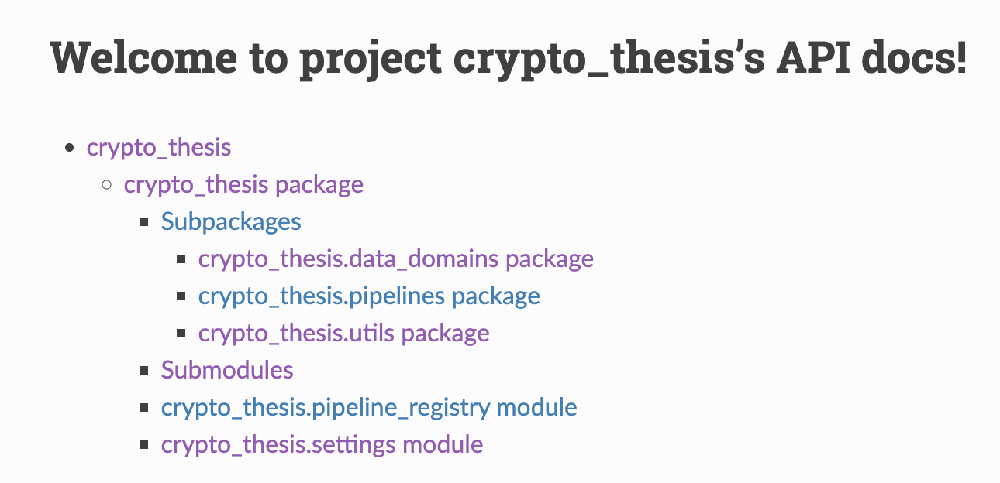

This project's objective is to predict the directional price movement of cryptocurrencies through Machine Learning (ML) models.

The project currently has 3 working and tested ML models: XGBoost, LSTM and Logistic Regression.

There are many parameters to be set in `conf/base/parameters` directory, and I really encourage people to test different combinations of them, but the ones in the production version are already tested and working.

The code was developed using Kedro framework, official docs: https://kedro.org and https://docs.kedro.org/en/stable/index.html

## Setup
### Dependencies
Using your preferrable environment manager, follow the steps below to install dependencies:
1. create a virtual environment
    - conda example: `conda create -n <name> python=3.8 -y && conda activate <name>`
2. install `requirements.txt`
    - `pip install -r requirements.txt`
3. install dependencies in `pyproject.toml` with `poetry`
    - `poetry lock && poetry install`

### Credentials
To collect raw data you need Binance credentials. The project expects to have 2 environment variables named `BINANCE_API_KEY` and `BINANCE_SECRET_KEY` with Binance's api key and secret, respectively.

## Assets
- `docs/diagrams` directory contains relevant diagrams for the project
- `docs/build/html/index.html` contains an HTML page with the API documentation for all the code and modules
    

## Data
- all datasets' types and paths are defined in the catalog at `conf/base/catalog` in yml files where the yml key is the dataset name defined in the pipelines

## Parameters
- all parameters are defined at `conf/base/parameters`
- parameters with value starting with `$` are defined in runtime when building the Kedro Session
    - example: `"${start_date}"` receives the start_date from parameter defined at `src/crypto_thesis/settings.py`