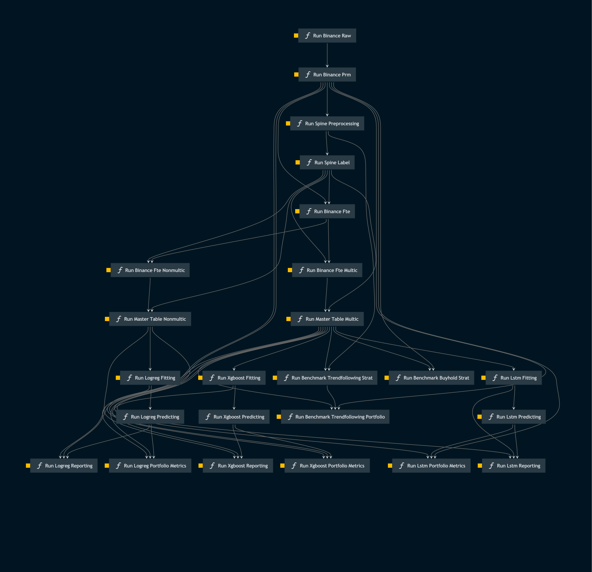

## Overview
- This project's objective is to predict the directional price movement of cryptocurrencies through Machine Learning (ML) models.
    - The project currently has 3 working and tested ML models: XGBoost, LSTM and Logistic Regression.

- There are many parameters to be set in `conf/base/parameters` directory, and I really encourage people to test different combinations of them, but the ones in the production version are already tested and working.

- The code was developed using Kedro framework, official docs: https://kedro.org and https://docs.kedro.org/en/stable/index.html
    - To run the project end-to-end type `kedro run` in the terminal prompt

## Simplified data flow
1. Pull crypto pairs from Binance in a pre-defined time interval (1 minute, 5 minutes, 15 minutes, ...)
2. Define the target coin, volume bar size, amount of bars looking ahead to predict and parameter tau for labeling
3. Adjust data types (float, datetime, ...)
4. For the target coin
    - Filter only the target coin
    - Transform prices into percent changes
    - Accumulate volume up to the volume bar size threshold
    - Define start and end times within the volume bar
    - Get target time and percent change of target time using the prediction amount of bars ahead
    - Create target label
5. For the features
    - Exclude target from the dataset
    - Transform prices into percent change
    - Loop over each start and end time windows (defined in the target step) and calculate features
        - Features in each window must be summarized into a single data point, so if the window has 50 rows it will become only 1 row per window
6. Merge both target and features into master table and drop null data
    - It will reduce the dataset for the least recent coin. example: if we have 3 coins (A, B and C) and A started in 2017, B in 2018 and C in 2019, the dataset will start in 2019
7. Build and run model, and generate model reporting
8. Build portfolio P&L and generate portfolio reporting
9. Compare portfolio with benchmark index

## Setup
### Dependencies
Using your preferrable environment manager, follow the steps below to install dependencies:
1. Create and activate a virtual environment
    - Conda example: `conda create -n <name> python=3.8 -y && conda activate <name>`
2. Install `requirements.txt` located at `src/requirements.txt`
    - `pip install -r requirements.txt`
3. Install dependencies in `pyproject.toml` with `poetry` (you must be located in the same directory as `pyproject.toml` file)
    - `poetry lock && poetry install`

Setup pre-commit to run on every commit
1. Install the dependencies as shown above
2. Run `pre-commit install`
    - **Optional**: if you already have a project before installing pre-commit, you might want to check all your files, for that run `pre-commit run --all-files`

### Credentials
To collect raw data you need Binance credentials. The project expects to have 2 environment variables named `BINANCE_API_KEY` and `BINANCE_SECRET_KEY` with Binance's api key and secret, respectively.

## Assets
- `docs/diagrams` directory contains relevant diagrams for the project
- `docs/build/html/index.html` contains an HTML page with the API documentation for all the code and modules
    - To regenerate this docs, run in your terminal `kedro build-docs` in the root directory of the project
    
- `docs/images/kedro-pipeline.png` contains the pipeline functions' execution flow
    - To regenerate this image, run in your terminal `kedro viz` and it will open a webpage where you can download it
    

## Data
- All datasets' types and paths are defined in the catalog at `conf/base/catalog` in yml files
    - The yml key is the dataset name used by the pipelines

## Parameters
- All parameters are defined at `conf/base/parameters`
- Parameters with value starting with `$` are defined in runtime when building the Kedro Session
    - Example: `"${start_date}"` receives the start_date from the parameter defined at `src/crypto_thesis/settings.py`
